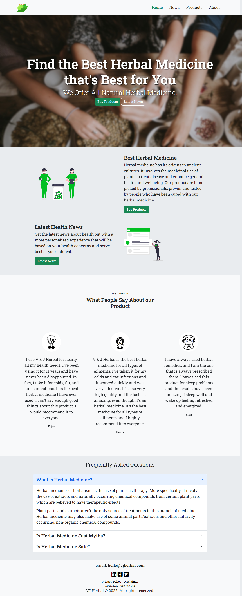
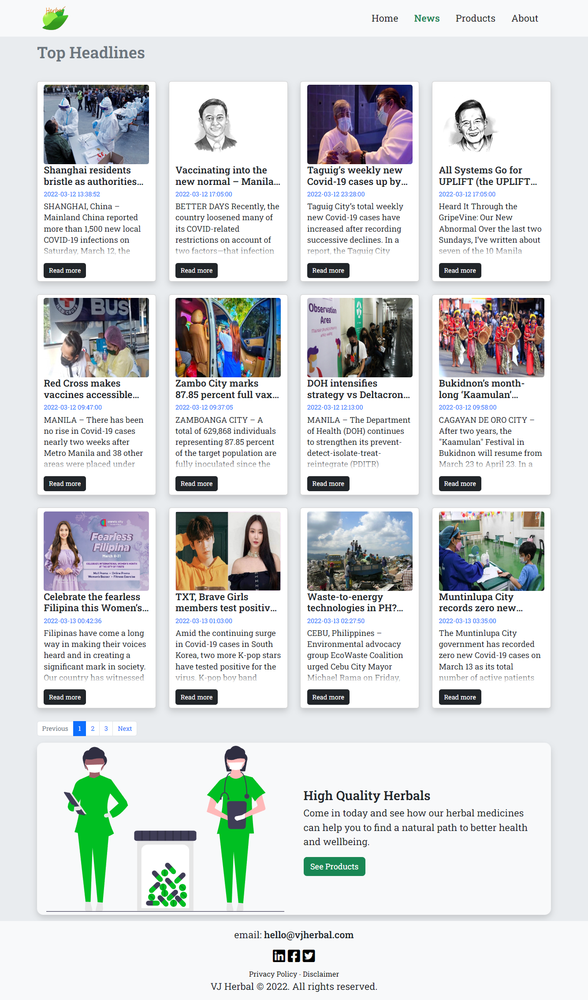
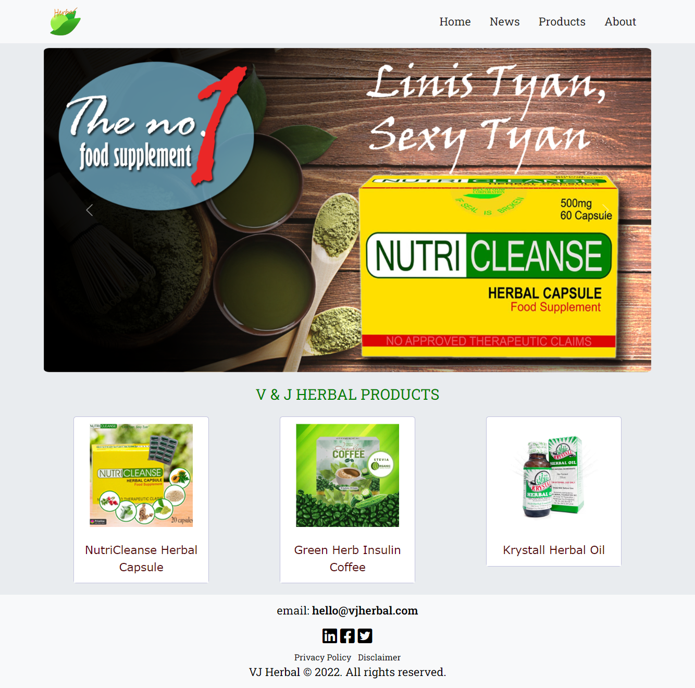
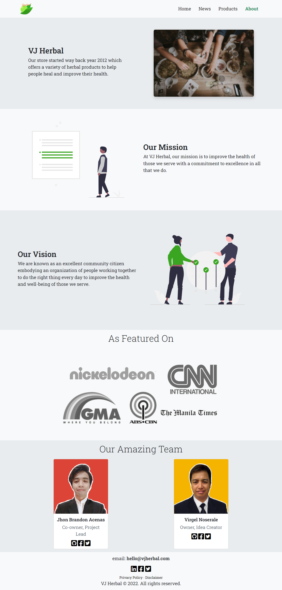

# Project Name
> This is a Herbal Seller's Website that also provides the latest news about health.
> Live demo on [Netlify](https://vjherbal.netlify.app/). <!-- If you have the project hosted somewhere, include the link here. -->
> Live demo on [GitHub Pages](https://virgelnoserale.github.io/miniproject2/). <!-- If you have the project hosted somewhere, include the link here. -->

## Table of Contents
* [General Info](#general-information)
* [Technologies Used](#technologies-used)
* [Features](#features)
* [Screenshots](#screenshots)
* [Setup](#setup)
* [Usage](#usage)
* [Project Status](#project-status)
* [Room for Improvement](#room-for-improvement)
* [Acknowledgements](#acknowledgements)
* [Contact](#contact)
<!-- * [License](#license) -->

## General Information
- The primary goal of this project is to utilize our acquired skills in HTML, CSS and JavaScript so far in the KodeGo Bootcamp.
- The business application of the website is for a small business to sell their product online.
- This is a by-pair project requirement of the KodeGo Bootcamp for project two
<!-- You don't have to answer all the questions - just the ones relevant to your project. -->

## Technologies Used
- Bootstrap 5.2
- Vanilla JavaScript
- Netlify
- World News API

## Features
List the ready features here:
- Provides the latest health news about health in the Philippines
- Has a complete user purchase flow of the available product
- Provides a brief description of the business.

## Screenshots
##Landing Page------------

##News Page------------

##Products Page------------

##About Page------------

<!-- If you have screenshots you'd like to share, include them here. -->

## Setup
The scope of this project is to be an API-driven Mini Web Application using Bootstrap, GitHub, JavaScript/JQuery, APIs, and Heroku/Netlify.

Just simply click the provided link for the demo of this website and feel free to explore and send us a feedback via the email provided at the end of this file.

## Usage
This website can be used for a small business that is looking to be set up online and have the capability to sell their products online.

<!-- `write-your-code-here` -->

## Project Status
Project is: _completed_. As the duration of this was from November 13 to December 12, 2022.

## Room for Improvement
We can further imporve the UI of the website especially on the news page. We can also further implement backend via firebase for the customers filled orders.

Room for improvement:
- UI of the News Page
- More relevant contents

To do:
- Add features for purchase flow

## Acknowledgements
Give credit here.
- This project was inspired by Mr. Virgel Noserale's Project One, which is a hospital website
- Many thanks to our Bootcamp Instructor Mr. Erwin Macaraig, the KodeGo team - Ms. Jhem, Mr. Gene, and Mr. Johnroe - our panelist for the presentation. Thanks to my partner, Mr. Virgel Noserale and to my fellow Kodemates.

## Contact
Created by [@jhonas](https://linktr.ee/hellojhonas) - feel free to contact me!

<!-- Optional -->
<!-- ## License -->
<!-- This project is open source and available under the [... License](). -->

<!-- You don't have to include all sections - just the one's relevant to your project -->